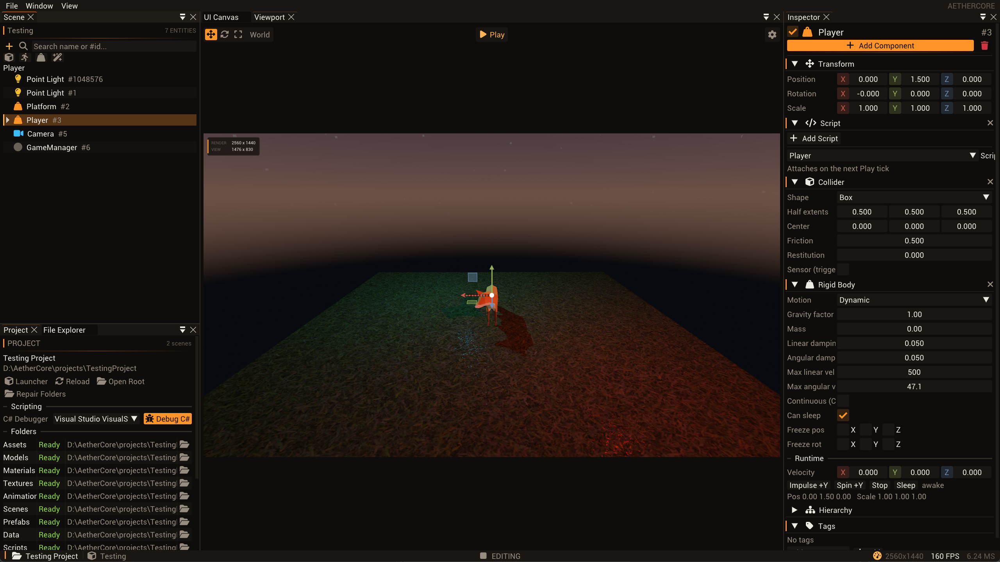
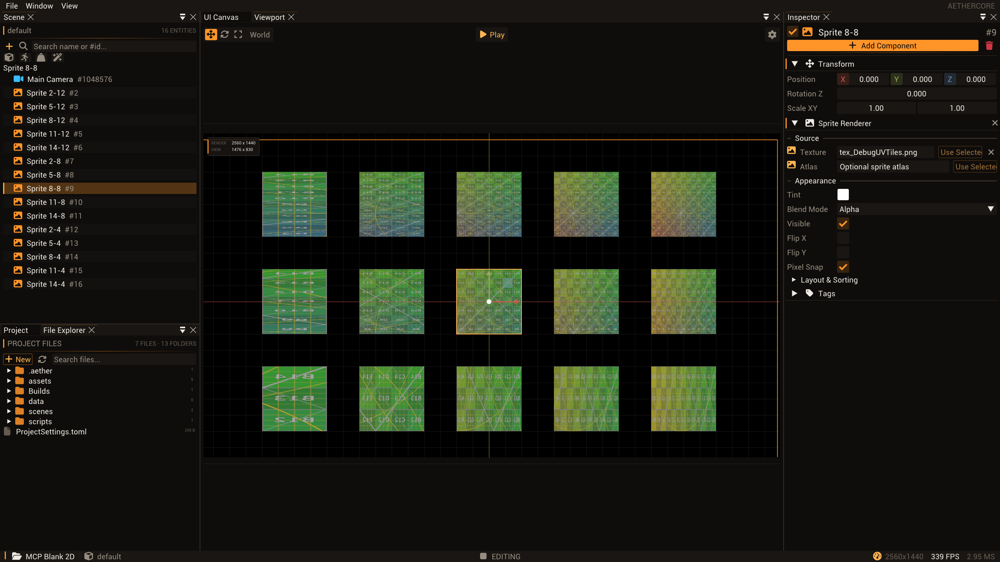
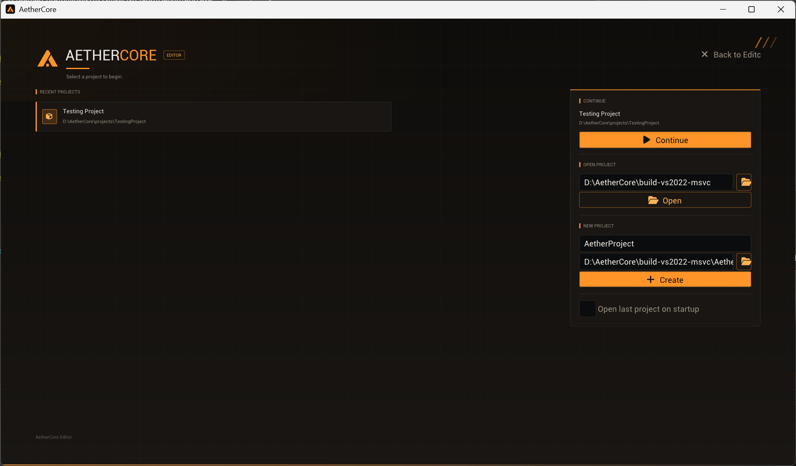
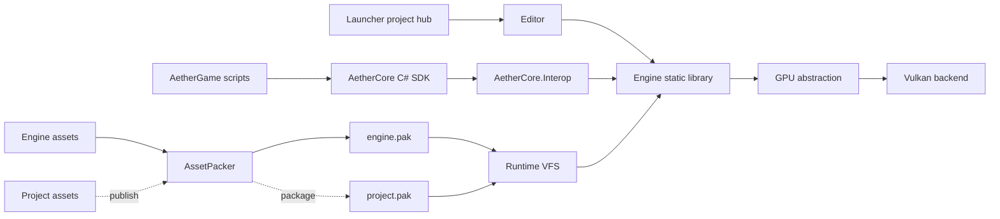

<p align="center">
  
</p>

<h1 align="center">AetherCore</h1>

<p align="center">
  <strong>A modern Vulkan game engine for 2D and 3D games, with an editor-first workflow and hot-reloadable C# gameplay.</strong>
</p>

<p align="center">
  
  
  
  
</p>

<p align="center">
  <a href="#what-is-aethercore">What is it</a> ·
  <a href="#quick-start">Quick start</a> ·
  <a href="#editor-workflow">Editor workflow</a> ·
  <a href="#2d-workflow">2D workflow</a> ·
  <a href="#c-scripting">C# scripting</a> ·
  <a href="#engine-mcp">Engine MCP</a> ·
  <a href="#architecture">Architecture</a> ·
  <a href="#asset-and-shipping-pipeline">Asset pipeline</a>
</p>

<br>



### 3D editor

Dockable viewport, hierarchy, and inspectors on the full render graph-GPU-driven culling, tiled lighting, shadows, and post-processing.
<br>
<br clear="all">



### 2D editor

The same shell in orthographic mode: sprite placement, non-destructive sheet slicing, and animation timelines with deterministic playback.

<br clear="all">
<br>



### Project Launcher

A standalone hub that spawns a dedicated Editor process per project and closes once startup finishes.

<br clear="all">

## At a glance

| Area | Current capabilities |
|---|---|
| **Editor** | Standalone project Launcher, Night Amber ImGui workspace, dockable viewport and inspectors, scene hierarchy, project/file browser, UI canvas tools, theme editor, render-graph and texture inspection |
| **2D authoring** | Blank 2D projects, orthographic 2D viewport and XY tools, sprite placement and picking, non-destructive sheet slicing, sprite animation timelines, deterministic playback, and 2D asset publishing |
| **Rendering** | Bindless descriptors, buffer device address, render graph, GPU-driven draw culling, tiled lighting, directional and local shadows, GTAO, FXAA, tonemapping, post-processing, offscreen cameras |
| **Scene and simulation** | EnTT world, reflection-driven component editing and scene serialization, typed asset identities, Jolt rigid bodies, skeletal animation, blending, root motion, day/night lighting |
| **Gameplay** | Public C# engine SDK, entity scripts, inspector-exposed fields, native interop boundary, collectible load contexts, F5 rebuild and hot reload, and one-click Visual Studio script debugging |
| **Assets** | Virtual file system, glTF import, mesh and animation processing, texture transcoding, material presets, one-time `engine.pak` staging, and publish-only project PAKs |
| **Diagnostics** | Tracy CPU/GPU instrumentation, render-pass timings, resource inspection, validation logging, built-in editor-control MCP scene authoring, and Visual Studio debugger MCP workflow |

> [!NOTE]
> AetherCore is under active development. The editor, runtime, scripting API, and
> asset formats are usable today, but backward compatibility is not guaranteed yet.

## Quick start

### Windows

Requirements:

- Visual Studio 2022 or newer with the Desktop development with C++ workload
- CMake 3.21+
- Vulkan SDK
- .NET 10 SDK for managed gameplay scripting

Configure and build the default MSVC development preset:

```powershell
cmake --preset default
cmake --build --preset default
```

This builds both the project hub and the editor. Start with the Launcher:

```text
build/src/app/RelWithDebInfo/Launcher.exe
```

For ClangCL:

```powershell
cmake --preset vs2022-clang
cmake --build --preset vs2022-clang
```

Open `managed/AetherCore.slnx` in **Visual Studio 2026** or Rider to edit the engine managed code (the `AetherCore` SDK and `AetherCore.Interop` boot assembly). A project's gameplay scripts live in `projects/<name>/scripts/` and are edited there. The `net10.0` projects do not load in VS 2022, but VS 2022 can still build the native C++ targets through CMake.

### Linux

The Linux preset uses Clang, Ninja, and `RelWithDebInfo`:

```bash
cmake --preset linux-clang
cmake --build --preset linux-clang
```

Requires the Vulkan loader and driver, Clang, Ninja, and GLFW's platform development packages. The .NET 10 SDK is optional-managed scripting is skipped when it is absent.

### Useful presets

| Preset | Purpose |
|---|---|
| `default` | VS 2022 MSVC development build (`RelWithDebInfo`) |
| `vs2022-clang` | VS 2022 generator with ClangCL |
| `clangd` | Ninja + clang-cl compilation database and clang-tidy target |
| `linux-clang` | Linux Ninja + Clang development build |
| `vs2022-msvc-release` | Ship configuration |
| `vs2022-msvc-retail` | Retail configuration with LTCG and stripped diagnostics |

## Editor workflow

1. Start `Launcher` and create or open a project; it spawns a dedicated `Editor` process and closes itself.
2. Build a scene with the hierarchy, inspector, viewport, asset browser, and component tools.
3. Add gameplay under the project's `scripts/` directory using the `AetherCore` SDK.
4. Enter play mode to run it. In a development build, press **F5** to rebuild and hot-reload gameplay code.
5. Use **Debug C#** in the Project panel to open scripts in Visual Studio with the debugger attached, or pack and publish a standalone build.
6. **File > Save & Return to Project Launcher…** saves and hands control back to the hub when switching projects.

Each project is rooted by `ProjectSettings.toml` and owns its assets, scenes, prefabs, scripts, build intermediates, and publish settings. Engine resources mount through `engine://`, project content through `project://`.

## 2D workflow

Choose **Blank 2D** in the Launcher for an orthographic camera, 2D viewport grid and XY tools, and sprite rendering. It is the same project structure and editor shell as 3D, so scenes still share assets, C# gameplay, UI, packaging, and the render graph.

1. Import a texture or sprite sheet, then open the **Sprite Slicer** to create and refine non-destructive regions with grid, trim, and pivot tools.
2. Drag sprites into the 2D viewport or create **Sprite** and **Animated Sprite** entities from the hierarchy.
3. Create animation clips in the **Sprite Animation** timeline, edit frame durations and events, then preview playback in Edit or Play mode.
4. Save, script, and publish normally. Sprite regions keep stable identities across compatible re-slices, and published projects package their sprites, atlases, animations, and scenes.

Physics2D and tilemaps are the next roadmap phases; the current 2D release focuses on production-ready sprite authoring and animation.

## C# scripting

Managed gameplay is split across three assemblies with a deliberate boundary:

| Assembly | Role |
|---|---|
| `AetherCore` | Public gameplay SDK: entities, world, input, camera, physics, logging, and components |
| `AetherCore.Interop` | ABI and CoreCLR boot layer used by the native host; hidden from normal game code |
| `AetherGame` | Project gameplay scripts loaded into a collectible context for hot reload |

Scripts derive from `EntityScript`. Public fields appear in the editor inspector and serialize with the entity:

```csharp
using System.Numerics;
using AetherCore;

namespace AetherGame;

public sealed class Spinner : EntityScript
{
    public float DegreesPerSecond = 90.0f;

    public override void OnUpdate(float deltaTime)
    {
        Vector3 euler = Self.EulerDegrees;
        euler.Y = (euler.Y + DegreesPerSecond * deltaTime) % 360.0f;
        Self.EulerDegrees = euler;
    }
}
```

The CMake build runs `dotnet build` when the .NET SDK is present and deploys the managed assemblies next to the native executable. NuGet dependencies declared by the game project resolve into the script load context.

## Engine MCP

AetherCore ships its own MCP server, so a coding agent can run the test gauntlet,
inspect the Launcher hub, or drive a live editor-editing scenes, managing panels,
querying the render graph, capturing textures and screenshots, and entering play
mode. The live-control endpoint listens only on `127.0.0.1`.

```powershell
cmake --build --preset default --target Editor aether-ctl
./scripts/Install-Mcp.ps1 -Targets codex
```

The Launcher owns the control port while its hub is open (`8787` by default) and hands
it off to the Editor it launches, so MCP tools follow the handoff without reconfiguration.
For a directly started Editor, set `AETHER_CONTROL_PORT=8787` or enable the **Control Server**
panel. See the [MCP setup guide](docs/mcp-setup.md#aethercore-mcp) and the [full engine MCP reference](tools/mcp/README.md).

## Architecture



The frame pipeline follows an extract-and-consume model: the producer thread gathers render data into an immutable `RenderFramePacket`, then the render thread consumes that packet without reading mutable ECS state. See [Render-frame extraction](docs/architecture/render-frame-extraction.md).

### Main native areas

| Path | Responsibility |
|---|---|
| `src/engine/gpu/` | Engine-facing device, command, handle, format, and synchronization abstractions |
| `src/engine/vulkan/` | Vulkan implementation, resource registry, swapchain, memory, descriptors, and diagnostics |
| `src/engine/rendering/` | Render graph, frame packets, queues, render thread, shadows, and pipeline state |
| `src/engine/scene/` | ECS world, scene subsystem, serialization-facing components, and hierarchy |
| `src/engine/assets/` | Asset database, glTF ingestion, model/texture creation, and upload services |
| `src/engine/material/` | Material authoring, registries, texture lifetime, and GPU material data |
| `src/engine/animation/` | Skeletons, clips, animation database, blending, and GPU skinning data |
| `src/engine/physics/` | Jolt integration and physics components |
| `src/engine/scripting/` | Native CoreCLR host and managed ABI bridge |
| `src/app/debug/` | Editor panels, inspectors, project controls, and shared editor chrome |
| `src/app/launcher/` | Standalone Launcher process, project hub, and Editor startup handoff |
| `src/app/imgui/` | Dear ImGui backend and editor UI rendering integration |

Subsystems are wired through `ServiceContainer`. Engine startup and shutdown order is dependency-sensitive, and GPU-backed services are destroyed before the GPU device.

## Asset and shipping pipeline

AetherCore keeps engine and project payloads separate:

| Mount | Build artifact | Contents |
|---|---|---|
| `engine://` | `data/engine.pak` | Fonts, editor branding, compiled shaders, and other engine-owned runtime resources; staged once for the shared app bundle |
| `project://` | Project directory during development; `data/project.pak` when publishing | The opened project's scenes, prefabs, scripts, models, materials, textures, and derived assets |
| `shaders://` | Overlay over engine and project shader intermediates | Engine shaders plus project overrides during editor development |

`AssetPacker` processes project content before packing-texture transcoding, mesh/skeleton/animation extraction, material generation, shader optimization, and zstd compression, depending on source type. `engine.pak` is built once for the shared Editor/Launcher bundle; `project.pak` is created only when publishing.

```powershell
AssetPacker --project --import-materials projects/TestingProject build/data/project.pak
```

Material presets can be authored as TOML:

```toml
[material]
baseColorFactor = [1.0, 1.0, 1.0, 1.0]
metallicFactor = 0.0
roughnessFactor = 0.9

[textures]
albedo = "project://assets/textures/base-color.png"
normal = "project://assets/textures/normal.png"
metallicRoughness = "project://assets/textures/metal-roughness.png"
```

Asset references are catalogued through stable `AssetId` values, while texture and material registries remain the owning backends. See [Asset Database](docs/asset-database.md) for the design and reload roadmap.

## Build targets

| Target | Output |
|---|---|
| `Engine` | Native static engine library |
| `Editor` | AetherCore editor executable |
| `Launcher` | Standalone project hub that starts a separate Editor for each selected project |
| `GameRuntime` | Standalone runtime executable (`AetherGame`) |
| `AssetPacker` | Asset import, conversion, and PAK command-line tool |
| `ManagedAssemblies` | Builds and deploys `AetherCore`, `AetherCore.Interop`, and project gameplay assemblies |
| `PackageGame` | Produces a clean redistributable runtime package |

## Build tiers and diagnostics

| Tier | Configuration | Profiling and checks |
|---|---|---|
| Debug | `Debug` | Tracy enabled, full assertions |
| Dev | `RelWithDebInfo` | Optimized with Tracy enabled |
| Ship | `Release` | Profiling disabled, minimal checks |
| Retail | `Release` + `AETHERCORE_RETAIL=ON` | Diagnostics stripped, LTCG where configured |

Common options:

| Option | Default | Effect |
|---|---:|---|
| `AETHERCORE_ENABLE_ASAN` | `OFF` | AddressSanitizer on first-party targets |
| `AETHERCORE_ENABLE_TRACY_GPU` | `ON` | Vulkan GPU timeline instrumentation |
| `AETHERCORE_ENABLE_TRACY_PLOTS` | `ON` | Tracy plot and counter streams |
| `AETHERCORE_ENABLE_TRACY_MEMORY` | `ON` | CPU allocation and named GPU-memory reporting |
| `AETHERCORE_ENABLE_SLANG` | `ON` | Slang shader compilation when `slangc` is available |
| `AETHERCORE_RETAIL` | `OFF` | Retail stripping and optimization policy |

## Repository map

```text
src/engine/                 Native engine library
src/app/                    Editor, Launcher, runtime shell, panels, and publishing tools
src/app/launcher/           Standalone project hub and Editor startup handoff
src/shaders/                Slang shader sources
src/include/                Shared binary-format headers
managed/AetherCore/         Public C# gameplay SDK
managed/AetherCore.Interop/ Managed ABI and CoreCLR boot assembly
projects/TestingProject/    Example editor project (scripts/AetherGame.csproj = game scripts)
resources/                  Engine-owned config, fonts, branding, and templates
tools/assetpack/            Asset processing and PAK tooling
tests/                      Doctest-based test sources
docs/                       Architecture, asset, tooling, and design notes
```

## Documentation

- [Asset database](docs/asset-database.md)
- [Render-frame extraction architecture](docs/architecture/render-frame-extraction.md)
- [MCP setup](docs/mcp-setup.md)
- [Visual Studio debugger MCP](docs/VisualStudio-MCP.md)

## Development notes

- Third-party dependencies are fetched with CPM and should not be edited under build directories.
- `clangd` users should regenerate `build/ninja-clang/compile_commands.json` with `cmake --preset clangd` after changing C++ source lists or CMake files.
- The repository contains doctest-based test sources, but no tests are currently registered with CTest; `ctest` is therefore a no-op today.
- Generated shader binaries and local tool state are intentionally excluded from source control.
