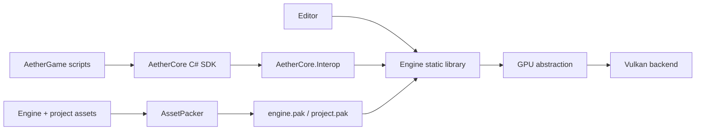

<p align="center">
  
</p>

<h1 align="center">AetherCore</h1>

<p align="center">
  <strong>A modern Vulkan game engine with an editor-first workflow and hot-reloadable C# gameplay.</strong>
</p>

<p align="center">
  
  
  
  
</p>

<p align="center">
  <a href="#quick-start">Quick start</a> ·
  <a href="#editor-workflow">Editor workflow</a> ·
  <a href="#engine-mcp">Engine MCP</a> ·
  <a href="#architecture">Architecture</a> ·
  <a href="#c-scripting">C# scripting</a> ·
  <a href="#asset-and-shipping-pipeline">Asset pipeline</a>
</p>

<!-- Screenshot slots: swap each placeholder for a current PNG/WebP capture when available. -->
<p align="center">
  
</p>
<p align="center"><sub>Editor overview</sub></p>

<p align="center">
  
</p>
<p align="center"><sub>Project Launcher</sub></p>

> [!NOTE]
> AetherCore is under active development. The editor, runtime, scripting API, and
> asset formats are usable today, but backward compatibility is not guaranteed yet.

## What is AetherCore?

AetherCore is a from-scratch game engine built around three ideas:

- **Keep the renderer explicit.** A GPU abstraction protects engine code from Vulkan details without hiding synchronization, resource lifetime, or render-graph structure.
- **Make the editor part of the engine.** Project creation, scene authoring, diagnostics, asset inspection, play mode, packaging, and publishing live in one coherent tool.
- **Keep gameplay iteration fast.** Game code is written against a small C# SDK and can be rebuilt and hot-reloaded without restarting the native engine.

The native engine uses C++26 with Clang and C++23 with other compilers. Rendering is Vulkan-based, the scene world is powered by EnTT, physics uses Jolt, and managed gameplay runs in-process on .NET 10 CoreCLR.

## At a glance

| Area | Current capabilities |
|---|---|
| **Editor** | Night Amber ImGui workspace, project launcher, dockable viewport and inspectors, scene hierarchy, project/file browser, UI canvas tools, theme editor, render-graph and texture inspection |
| **Rendering** | Bindless descriptors, buffer device address, render graph, GPU-driven draw culling, tiled lighting, directional and local shadows, GTAO, FXAA, tonemapping, post-processing, offscreen cameras |
| **Scene and simulation** | EnTT world, serializable scenes and prefabs, typed asset identities, Jolt rigid bodies, skeletal animation, blending, root motion, day/night lighting |
| **Gameplay** | Public C# engine SDK, entity scripts, inspector-exposed fields, native interop boundary, collectible load contexts, F5 rebuild and hot reload |
| **Assets** | Virtual file system, glTF import, mesh and animation processing, texture transcoding, material presets, zstd-compressed engine/project PAKs |
| **Diagnostics** | Tracy CPU/GPU instrumentation, render-pass timings, resource inspection, validation logging, built-in editor-control MCP, Visual Studio debugger MCP workflow |

## Quick start

### Windows

Requirements:

- Visual Studio 2022 or newer with the Desktop development with C++ workload
- CMake 3.21+
- Vulkan SDK
- .NET 10 SDK for managed gameplay scripting

Configure and build the default MSVC development preset:

```powershell
cmake --preset default
cmake --build --preset default
```

The editor executable is written to:

```text
build/src/app/RelWithDebInfo/Launcher.exe
```

For ClangCL:

```powershell
cmake --preset vs2022-clang
cmake --build --preset vs2022-clang
```

Open `managed/AetherCore.slnx` in **Visual Studio 2026** or Rider to edit the engine managed code — the `AetherCore` SDK and `AetherCore.Interop` boot assembly (engine code only; a project's gameplay scripts live in `projects/<name>/scripts/` and are edited there). The `net10.0` projects do not load in Visual Studio 2022; this does not prevent VS 2022 from building the native C++ targets through CMake.

### Linux

The Linux preset uses Clang, Ninja, and `RelWithDebInfo`:

```bash
cmake --preset linux-clang
cmake --build --preset linux-clang
```

The Vulkan loader, a working Vulkan driver, Clang, Ninja, and the platform development packages required by GLFW must be available. The .NET 10 SDK is optional; managed scripting is skipped when the SDK is not found.

### Useful presets

| Preset | Purpose |
|---|---|
| `default` | VS 2022 MSVC development build (`RelWithDebInfo`) |
| `vs2022-clang` | VS 2022 generator with ClangCL |
| `clangd` | Ninja + clang-cl compilation database and clang-tidy target |
| `linux-clang` | Linux Ninja + Clang development build |
| `vs2022-msvc-release` | Ship configuration |
| `vs2022-msvc-retail` | Retail configuration with LTCG and stripped diagnostics |

## Editor workflow

1. Start `Launcher` and create or open a project; it spawns the `Editor` for that project.
2. Build a scene with the hierarchy, inspector, viewport, asset browser, and component tools.
3. Add gameplay under the project's `scripts/` directory using the `AetherCore` managed SDK.
4. Enter play mode to run the scene. In a development build, press **F5** to rebuild and hot-reload gameplay code.
5. Use the Project panel to pack project content or publish a standalone build.

Each project is rooted by `ProjectSettings.toml` and owns its assets, scenes, prefabs, scripts, build intermediates, and publishing settings. Engine resources remain separate and are mounted through `engine://`; opened project content is mounted through `project://`.

## Engine MCP

AetherCore includes its own MCP server, so a coding agent can run the test
gauntlet or work with a live editor: inspect and edit scenes, manage editor
panels, query the render graph, capture textures and screenshots, and enter play
mode. The live-control endpoint is editor-only and listens on `127.0.0.1`.

```powershell
cmake --build --preset default --target Editor aether-ctl
./scripts/Install-Mcp.ps1 -Targets codex
```

Start the editor with `AETHER_CONTROL_PORT=8787`, or enable it from the editor's
**Control Server** panel. The port must match the MCP configuration. See the
[MCP setup guide](docs/mcp-setup.md#aethercore-mcp) for the short setup path and
the [full engine MCP reference](tools/mcp/README.md) for all tools and options.

## Architecture



The frame pipeline follows an extract-and-consume model: the producer thread gathers render data into an immutable `RenderFramePacket`, then the render thread consumes that packet without reading mutable ECS state. See [Render-frame extraction](docs/architecture/render-frame-extraction.md).

### Main native areas

| Path | Responsibility |
|---|---|
| `src/engine/gpu/` | Engine-facing device, command, handle, format, and synchronization abstractions |
| `src/engine/vulkan/` | Vulkan implementation, resource registry, swapchain, memory, descriptors, and diagnostics |
| `src/engine/rendering/` | Render graph, frame packets, queues, render thread, shadows, and pipeline state |
| `src/engine/scene/` | ECS world, scene subsystem, serialization-facing components, and hierarchy |
| `src/engine/assets/` | Asset database, glTF ingestion, model/texture creation, and upload services |
| `src/engine/material/` | Material authoring, registries, texture lifetime, and GPU material data |
| `src/engine/animation/` | Skeletons, clips, animation database, blending, and GPU skinning data |
| `src/engine/physics/` | Jolt integration and physics components |
| `src/engine/scripting/` | Native CoreCLR host and managed ABI bridge |
| `src/app/debug/` | Editor panels, project launcher, inspectors, and shared editor chrome |
| `src/app/imgui/` | Dear ImGui backend and editor UI rendering integration |

Subsystems are wired through `ServiceContainer`. Engine startup and shutdown order is dependency-sensitive, and GPU-backed services are destroyed before the GPU device.

## C# scripting

Managed gameplay is split across three assemblies with a deliberate boundary:

| Assembly | Role |
|---|---|
| `AetherCore` | Public gameplay SDK: entities, world, input, camera, physics, logging, and components |
| `AetherCore.Interop` | ABI and CoreCLR boot layer used by the native host; hidden from normal game code |
| `AetherGame` | Project gameplay scripts loaded into a collectible context for hot reload |

Scripts derive from `EntityScript`. Public fields appear in the editor inspector and serialize with the entity:

```csharp
using System.Numerics;
using AetherCore;

namespace AetherGame;

public sealed class Spinner : EntityScript
{
    public float DegreesPerSecond = 90.0f;

    public override void OnUpdate(float deltaTime)
    {
        Vector3 euler = Self.EulerDegrees;
        euler.Y = (euler.Y + DegreesPerSecond * deltaTime) % 360.0f;
        Self.EulerDegrees = euler;
    }
}
```

The CMake build invokes `dotnet build` when the .NET SDK is available and deploys the managed assemblies next to the native executable. NuGet dependencies declared by the game project are resolved into the script load context.

## Asset and shipping pipeline

AetherCore keeps engine and project payloads separate:

| Mount | Build artifact | Contents |
|---|---|---|
| `engine://` | `data/engine.pak` | Fonts, editor branding, compiled shaders, and other engine-owned runtime resources |
| `project://` | `data/project.pak` | The opened project's scenes, prefabs, scripts, models, materials, textures, and derived assets |
| `shaders://` | Overlay over engine/project shader outputs | Engine shaders plus project overrides during editor development |

`AssetPacker` processes project content before packing. Depending on source type, that includes texture transcoding, mesh/skeleton/animation extraction, material generation, shader optimization, and zstd compression.

```powershell
AssetPacker --project --import-materials projects/TestingProject build/data/project.pak
```

Material presets can be authored as TOML:

```toml
[material]
baseColorFactor = [1.0, 1.0, 1.0, 1.0]
metallicFactor = 0.0
roughnessFactor = 0.9

[textures]
albedo = "project://assets/textures/base-color.png"
normal = "project://assets/textures/normal.png"
metallicRoughness = "project://assets/textures/metal-roughness.png"
```

Asset references are catalogued through stable `AssetId` values while existing texture and material registries remain the owning backends. The current design and its reload roadmap are documented in [Asset Database](docs/asset-database.md).

## Build targets

| Target | Output |
|---|---|
| `Engine` | Native static engine library |
| `Editor` | AetherCore editor executable |
| `GameRuntime` | Standalone runtime executable (`AetherGame`) |
| `AssetPacker` | Asset import, conversion, and PAK command-line tool |
| `ManagedAssemblies` | Builds and deploys `AetherCore`, `AetherCore.Interop`, and project gameplay assemblies |
| `PackageGame` | Produces a clean redistributable runtime package |

## Build tiers and diagnostics

| Tier | Configuration | Profiling and checks |
|---|---|---|
| Debug | `Debug` | Tracy enabled, full assertions |
| Dev | `RelWithDebInfo` | Optimized with Tracy enabled |
| Ship | `Release` | Profiling disabled, minimal checks |
| Retail | `Release` + `AETHERCORE_RETAIL=ON` | Diagnostics stripped, LTCG where configured |

Common options:

| Option | Default | Effect |
|---|---:|---|
| `AETHERCORE_ENABLE_ASAN` | `OFF` | AddressSanitizer on first-party targets |
| `AETHERCORE_ENABLE_TRACY_GPU` | `ON` | Vulkan GPU timeline instrumentation |
| `AETHERCORE_ENABLE_TRACY_PLOTS` | `ON` | Tracy plot and counter streams |
| `AETHERCORE_ENABLE_TRACY_MEMORY` | `ON` | CPU allocation and named GPU-memory reporting |
| `AETHERCORE_ENABLE_SLANG` | `ON` | Slang shader compilation when `slangc` is available |
| `AETHERCORE_RETAIL` | `OFF` | Retail stripping and optimization policy |

## Repository map

```text
src/engine/                 Native engine library
src/app/                    Editor, runtime shell, panels, and publishing tools
src/shaders/                Slang shader sources
src/include/                Shared binary-format headers
managed/AetherCore/         Public C# gameplay SDK
managed/AetherCore.Interop/ Managed ABI and CoreCLR boot assembly
projects/TestingProject/    Example editor project (scripts/AetherGame.csproj = game scripts)
resources/                  Engine-owned config, fonts, branding, and templates
tools/assetpack/            Asset processing and PAK tooling
tests/                      Doctest-based test sources
docs/                       Architecture, asset, tooling, and design notes
```

## Documentation

- [Asset database](docs/asset-database.md)
- [Render-frame extraction architecture](docs/architecture/render-frame-extraction.md)
- [MCP setup](docs/mcp-setup.md)
- [Visual Studio debugger MCP](docs/VisualStudio-MCP.md)

## Development notes

- Third-party dependencies are fetched with CPM and should not be edited under build directories.
- `clangd` users should regenerate `build/ninja-clang/compile_commands.json` with `cmake --preset clangd` after changing C++ source lists or CMake files.
- The repository contains doctest-based test sources, but no tests are currently registered with CTest; `ctest` is therefore a no-op today.
- Generated shader binaries and local tool state are intentionally excluded from source control.
