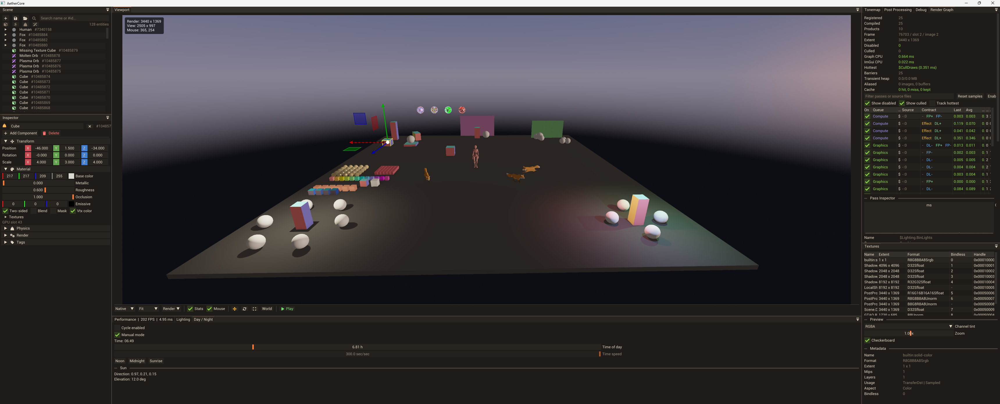

# ⚡ AetherCore

A modern **C++26/23 Vulkan game engine** with a bindless GPU pipeline, ECS-driven
gameplay, Jolt physics, skeletal animation, a coroutine runtime, and **hot-reloadable
C# gameplay scripting** hosted on .NET 10 (CoreCLR).

<!--
  Hero image: drop a screenshot of the engine at docs/images/aethercore.png
  (or tell me the path you used and I'll update this reference).
-->
<p align="center">
  
</p>

---

## ✨ Highlights

**Rendering & GPU**
- **GPU abstraction layer** - `GpuDevice`/`GpuTypes` wrap Vulkan behind a generic interface; core engine code never touches Vulkan directly.
- **Bindless resources** - materials, textures, and vertex data accessed via bindless descriptors + BDA (buffer device address).
- **GPU heap allocator** - device-local memory arena with typed `GpuSpan<T>` suballocations (GPU malloc/free), used by `MeshArena` and the animation database.
- **Render graph** - GPU culling, forward pass, tiled lighting, CSM shadows, post-processing, triple buffering.
- **Async compute** - dedicated async compute context for overlapping GPU work.
- **Offscreen rendering** - render-to-texture camera targets.

**Simulation & gameplay**
- **ECS world** - EnTT-based entity/component system with typed entity handles.
- **Jolt physics** - component-based rigid body and shape authoring.
- **Skeletal animation** - GPU skinning pipeline with blending and root motion.
- **Day/night cycle** - time-of-day driven lighting.
- **C# scripting** - hot-reloadable gameplay logic on .NET 10 (see [C# Scripting](#-c-scripting)).

**Engine foundations**
- **Subsystem orchestrator** - engine decomposed into `RenderingSubsystem`, `SceneSubsystem`, `AssetSubsystem`, `CameraSubsystem`, `PlatformSubsystem`, and other focused services wired through a `ServiceContainer` service locator.
- **Coroutine runtime** - `async<T>`, `executor`, `queued_executor`, `channel<T>`, `sleep_for` under `aether::coro`; lazy async for asset I/O and render-thread sync.
- **Error handling** - `Expected<T>` over C++26 `std::expected`, `AetherError` with typed log categories, `AE_ASSERT`/`AE_TRY` macros; Vulkan calls, asset loads, and I/O are all error-checked.
- **Frame pacer** - regulates game-thread cadence to a target FPS with coarse-sleep + fine-spin timing.

**Tooling**
- **ImGui debug tooling** - dockable panels for render stats, scene inspection, viewport controls, lighting, and diagnostics.
- **Asset pipeline** - virtual file paths (`engine://`, `project://`, `shaders://`), `.pak` bundles with zstd compression, PBR material presets via TOML, plus a processor for mesh optimization, texture compression, and SPIR-V optimization.
- **Tracy profiling** - integrated instrumentation via engine macros, stripped in Ship builds.

---

## 🎮 C# Scripting

Gameplay is written in C# and runs on an in-process **.NET 10 (CoreCLR)** host. The native
engine exposes a C ABI that a thin managed layer binds; game scripts see only a clean SDK.

**Three assemblies, one clear boundary:**

| Assembly | Role |
|---|---|
| `AetherCore` (`managed/AetherCore`) | The **SDK** - the public gameplay API (`Entity`, `World`, `Input`, `Camera`, `Physics`, …). This is all game code sees. |
| `AetherCore.Interop` (`managed/AetherCore.Interop`) | The **ABI + host boot** layer the native `DotNetHost` binds. Hidden from game code. |
| `AetherGame` (`game/AetherGame`) | Your **gameplay scripts**, loaded into a collectible load context that swaps at runtime for hot reload. |

Scripts derive from `EntityScript`; public fields are surfaced in the inspector and
serialized per-entity:

```csharp
using System.Numerics;
using AetherCore;

namespace AetherGame;

public sealed class Spinner : EntityScript
{
    public float DegreesPerSecond = 90f;   // editable in the inspector, saved with the scene

    public override void OnUpdate(float dt)
    {
        Self.EulerDegrees += new Vector3(0f, DegreesPerSecond * dt, 0f);
    }
}
```

**Authoring workflow**
- **Edit → F5 → live.** Press F5 in-game and the engine rebuilds `AetherGame` from source
  and reloads it into a fresh load context - no restart. (Dev builds only; a packaged build
  reloads the prebuilt assembly.)
- **Full IDE support.** Open the checked-in `AetherCore.slnx` in **Visual Studio 2026 or Rider**
  for IntelliSense, refactoring, and breakpoint debugging of scripts while the engine runs.
  (The `net10.0` projects require VS 2026 — they will not load in VS 2022. CLion opens
  `CMakeLists.txt` for the C++ side; the solution is a cross-platform IDE convenience - the
  build never depends on it.)
- **NuGet.** Add `PackageReference` items to `AetherGame`; dependencies resolve into the
  script load context at runtime.

> The C# projects are built by CMake via `dotnet build` (gated on the .NET SDK being
> present) and deployed next to the executable, so a machine without .NET still builds the
> engine - scripting simply disables itself.

---

## 🗂️ Project Layout

```
src/
  engine/                  The engine static library (see breakdown below)
  app/                     Executable: Application loop, layers, entry point
managed/
  AetherCore/              C# SDK: public gameplay API + internal native binding layer
  AetherCore.Interop/      C# ABI + CoreCLR host boot (bound by the native DotNetHost)
game/
  AetherGame/              C# gameplay scripts (hot-reloaded)
shaders/                   Slang shader sources
resources/                 Source assets, packed at build time
  animations/  data/  fonts/  materials/  models/
tools/assetpack/           Asset packer with mesh/texture/SPIR-V processing
include/                   Shared binary-format headers (BinaryFormats, PakFormat)
scripts/                   Dev/build helpers (PowerShell, Python)
tests/                     Unit tests (doctest)
CMake/                     CPM + dependency/helper modules
docs/                      Design specs and images
AetherCore.slnx            Hand-authored C# solution, XML format (VS 2026 / Rider entry point)
```

<details>
<summary><strong>src/engine/ breakdown</strong></summary>

```
AetherCore.hpp/cpp       Engine orchestrator - owns all subsystems
ServiceContainer.hpp     Service locator for subsystem wiring
animation/               Skeletal animation system
assets/                  Asset subsystem, glTF loader, asset manager
camera/                  Camera objects, camera manager, camera subsystem
gpu/                     GPU abstraction (GpuDevice, AsyncComputeContext, BindlessManager)
io/                      Virtual file system, PAK/directory backends, coroutine async I/O
material/                Material presets, texture loading, bindless descriptor management
mesh/                    Mesh types, mesh arena, upload queue, primitive meshes
passes/                  Render passes (cull, forward, post-process, skybox)
physics/                 Jolt physics integration
platform/                Window, input, crash handler, platform subsystem
rendering/               Render graph, render queue, pipelines, shadow service, render thread
scene/                   Scene graph, ECS helpers, world, scene subsystem
scripting/               DotNetHost (CoreCLR), managed interop ABI
imgui/                   Dear ImGui integration for debug/tooling UI
utils/                   Logger, profiler, settings, Expected<T>/AetherError, frame pacer
utils/coro/              Coroutine primitives: Task, Channel, Executor, Sleep
vulkan/                  Vulkan context, swapchain, resource pools, GPU heap, shader utils
```

`src/app/` hosts the `Application` loop, `main.cpp`, the layer stack
(`ScriptedSceneLayer`, `DebugLayer`), and the C# scripting subsystem.
</details>

---

## 🔧 Building

### Windows

**Prerequisites:** Visual Studio 2022 or 2026, CMake 4.0+, Vulkan SDK, and (for C# scripting)
the **.NET 10 SDK**. Rider works too - open `AetherCore.slnx` for the scripts. Note: opening
the C# solution in the IDE needs **VS 2026** (the `net10.0` projects don't load in VS 2022).

**Compiler support:** Clang-cl uses C++26. MSVC uses C++23 (MSVC does not yet support C++26).

```powershell
cmake --preset vs2022-msvc
cmake --build --preset vs2022-msvc --config Debug

# also: vs2022-clang, vs2026-msvc, vs2026-clang
```

### Linux

**Prerequisites:** Clang 13+, CMake 4.0+, Vulkan SDK, Ninja, and the .NET 10 SDK (optional,
for scripting).

```bash
sudo apt-get install build-essential cmake git ninja-build clang libvulkan-dev vulkan-tools \
  libglfw3-dev libglm-dev libfreetype6-dev

cmake --preset linux-clang
cmake --build --preset linux-clang
./build/src/app/App
```

> If you use a non-standard Vulkan SDK, set `VULKAN_SDK` in your environment before running
> CMake. To build without C# scripting, no extra flag is needed - the managed build is
> skipped automatically when the .NET SDK is absent.

### CMake Options

| Option | Default | Description |
|---|---|---|
| `AETHERCORE_ENABLE_ASAN` | `OFF` | Enable AddressSanitizer on all first-party targets |
| `AETHERCORE_FAST_MSVC_DEBUG_INFO` | `ON` | `/Z7` + `/DEBUG:FASTLINK` in Debug for faster MSVC iteration |

---

## 📦 Asset Pipeline

Engine-owned resources under `resources/` are packed into `build/data/engine.pak` as a post-build step and accessed through `engine://...`. Game/project content is packed separately as `build/data/project.pak` and accessed through `project://...`. The asset packer (`tools/assetpack/`) runs dedicated processors for mesh optimization, texture compression, and SPIR-V optimization.

### PBR Material Presets

Define reusable project materials as TOML under the opened project's `assets/materials/` folder:

```toml
[material]
baseColorFactor = [1.0, 1.0, 1.0, 1.0]
metallicFactor  = 0.0
roughnessFactor = 0.9

[textures]
albedo            = "project://assets/textures/your_basecolor.png"
normal            = "project://assets/textures/your_normal.png"
metallicRoughness = "project://assets/textures/your_metalrough.png"
```

A folder layout (handy for downloaded PBR zips) also works, and the importer auto-generates
`properties.toml` from common naming patterns (`*_Color`, `*_NormalGL`, `*_Roughness`, …),
leaving hand-authored files untouched:

```powershell
AssetPacker --project --import-materials projects/TestingProject build/data/project.pak
```

---

## 🔬 Profiling

Tracy is active in Debug and Dev (`RelWithDebInfo`) builds and stripped in Ship/Retail
(`Release`) via linker GC, controlled by `src/engine/Defines.hpp` (`TRACY_ENABLE` per build
tier). Sub-streams can be toggled independently:

```powershell
cmake --preset default -DAETHERCORE_ENABLE_TRACY_GPU=OFF
cmake --preset default -DAETHERCORE_ENABLE_TRACY_PLOTS=OFF
cmake --preset default -DAETHERCORE_ENABLE_TRACY_MEMORY=OFF
```

---

## 📚 Dependencies

Native dependencies are fetched via CMake / CPM; C# scripting uses the .NET 10 SDK.

| Library | Purpose |
|---|---|
| Vulkan SDK | Graphics API |
| vk-bootstrap | Vulkan instance/device setup |
| VulkanMemoryAllocator | GPU memory management |
| GLFW | Window and input |
| GLM | Math |
| EnTT | ECS |
| Jolt Physics | Rigid body simulation |
| stb | Image loading |
| cgltf | glTF model loading |
| FreeType | Font rasterization |
| Tracy | Performance profiling |
| libzstd | PAK compression |
| xxHash | Hash-based asset IDs |
| toml++ | TOML config parsing |
| .NET 10 (CoreCLR) | C# gameplay scripting host |
