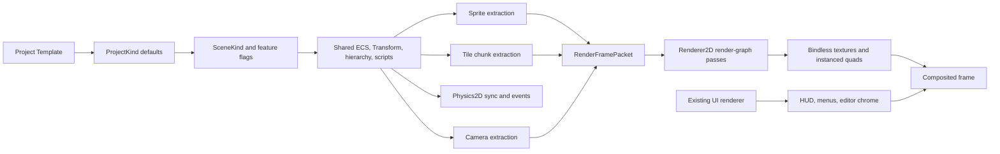

# Feature-Rich 2D Engine Plan and Roadmap

**Date:** 2026-07-15

**Status:** In progress; Phase 0 complete

**Target:** A native 2D game workflow inside AetherCore, sharing the existing world, asset, scripting, editor, and rendering foundations without treating game-world sprites as UI.

---

## Executive Summary

AetherCore should gain a dedicated world-space 2D stack alongside its existing 3D stack. A 2D project will still use the full engine runtime, ECS, scene hierarchy, asset database, managed scripting host, render graph, and editor shell. It will select 2D-oriented defaults and features through an explicit project template and scene kind.

The existing UI renderer remains responsible for screen-space interfaces, HUDs, menus, and editor chrome. It is not the foundation for world sprites. The 2D renderer will instead extract immutable sprite, tile, camera, and debug data from the ECS on the game thread into `RenderFramePacket`, then render that packet on the render thread in large instanced batches.

The first useful release is a vertical slice: create a Blank 2D project, import and slice a sprite sheet, place and animate sprites in an orthographic viewport, run the scene, save it, and control it from managed gameplay code. Physics and tilemaps then build on that foundation.

## Product Goals

- Create complete 2D games without routing world content through the UI system.
- Offer `Blank 3D` and `Blank 2D` project templates at project creation.
- Support orthographic and pixel-perfect cameras.
- Import, slice, preview, and edit sprite sheets non-destructively.
- Render large sprite and tile worlds with predictable batching, culling, and sorting.
- Support sprite animation, pivots, tint, flipping, layering, and material overrides.
- Provide native 2D collision, rigid bodies, triggers, joints, queries, and events.
- Author large chunked tilemaps with palettes, layers, collision, and streaming-friendly data.
- Expose the 2D stack through component reflection, scene serialization, MCP/editor control, and the managed gameplay SDK.
- Preserve mixed 2D/3D scenes where useful, including 2.5D games and 3D effects over 2D worlds.

## Non-Goals

- Replacing the current UI renderer with the sprite renderer.
- Replacing the 3D renderer, ECS, scene hierarchy, scripting runtime, or asset database.
- Creating one ECS entity per tile.
- Making the render thread query or mutate the ECS.
- Forcing 2D physics through Jolt's 3D simulation model.
- Shipping every advanced feature before the sprite vertical slice is usable.
- Making project templates separate engine forks or permanently incompatible project types.

## Hard Invariants

- The render thread only consumes immutable extracted frame data; it never touches the ECS.
- Bindless textures remain descriptor set 0 in every new sprite, tile, particle, and 2D lighting shader.
- GPU resources are released only after the required GPU-idle and lifetime guarantees.
- `RuntimeProfile::UiShell` remains slim and does not gain scene, sprite-world, or physics systems.
- A 2D game uses `RuntimeProfile::Full` with scene/render feature selection, not the UI-shell runtime.
- Scene transforms retain their existing world-space serialization behavior.
- New editable component fields enter through component reflection so the Inspector, Add Component palette, serializer, and control API stay aligned.
- Tilemap cell data lives in a dedicated asset, while the scene stores a component that references that asset.

## Why the UI Renderer Is Not the 2D World Renderer

The UI backend already has useful GPU traits: growable mapped buffers, bindless texture resolution, and a single instanced draw for its command stream. Its data and behavior are nevertheless designed for screen-space retained UI:

- layout is resolved from canvas hierarchies rather than world transforms and cameras;
- painter order is derived from UI traversal rather than explicit world sorting rules;
- it has no world-frustum or chunk culling;
- it rebuilds screen-space commands each frame;
- it has no sprite atlas, animation, tilemap, world-unit, or physics concepts;
- clipping and text behavior are UI concerns, not a substitute for a world render pipeline.

The 2D renderer may reuse lower-level engine facilities and patterns, but it must own a world-oriented render contract.

## Architecture

### Runtime Ownership

| Concern | Owner | Notes |
|---|---|---|
| World entities and transforms | Existing scene/ECS | Shared between 2D, 3D, and mixed scenes |
| Sprite and tile extraction | Game thread | Culls, resolves assets, and writes immutable packet data |
| Sprite/tile draw submission | Render thread | Reads packet data only |
| 2D simulation | `Physics2DSystem` | Separate Box2D-backed world with buffered commands/events |
| UI/HUD | Existing UI subsystem | Drawn as a screen-space layer after or around world passes |
| Editor authoring | Existing editor shell plus 2D tools | One viewport with scene-kind-aware behavior |

## Project Templates and Scene Kinds

Templates are creation-time recipes. Scene kinds are persistent authoring/runtime intent. They are related but not interchangeable.

### Initial Templates

| Template | Initial content | Defaults |
|---|---|---|
| Blank 3D | Current starter scene | Perspective camera, 3D grid and tools, 3D render features |
| Blank 2D | Empty 2D starter scene | Orthographic camera, 2D grid and tools, sprite render feature |

Later templates can include `2D Platformer`, `2D Top-Down`, and `2D Puzzle`, but they should be data recipes built on the same systems rather than new runtime modes.

### Persistent Metadata

- `ProjectKind`: records the project's preferred creation and editor defaults.
- `SceneKind`: `Scene3D`, `Scene2D`, or `Mixed`.
- `SceneFeatureFlags`: enables systems such as sprites, tilemaps, Physics2D, 3D meshes, lighting, or navigation.

`SceneKind` should guide defaults, validation, viewport behavior, and which systems are active. It should not prohibit adding a 3D mesh to a 2D scene or a sprite to a 3D scene.

### Blank 2D Starter Scene

- Orthographic main camera at a conventional 2D origin.
- Pixel-perfect mode available but not forced.
- 2D viewport grid and XY-plane manipulation.
- Sprite render feature enabled.
- Physics2D disabled until first use or enabled by the chosen template.
- A short sample script only in teaching-oriented templates, not Blank 2D.

## Core Data Model

### Components

| Component | Key authored fields | Runtime-only state |
|---|---|---|
| `SpriteRendererComponent` | sprite reference, color, flip X/Y, layer, order, blend mode, visibility, material override | resolved atlas/texture handles |
| `SpriteAnimatorComponent` | animation clip, autoplay, speed, loop mode, start frame | time, current frame, event cursor |
| `SortingGroupComponent` | layer, order offset, group mode | resolved sort range |
| `CameraComponent` additions | projection mode, orthographic size, pixel-perfect settings | computed projection and snap data |
| `RigidBody2DComponent` | body type, gravity scale, damping, rotation lock, continuous collision | Box2D body handle |
| `Collider2DComponent` | shape, size/radius/vertices, offset, density, friction, restitution, trigger, filter | Box2D shape handles |
| `Joint2DComponent` | joint type, connected entity, anchors, limits, motor | Box2D joint handle |
| `TileMapComponent` | tilemap asset, visible layers, tint, sorting base | resident chunk handles |

The first release can keep one primary collider component with a shape enum. If authoring or scripting becomes awkward, it may later split into box, circle, capsule, polygon, and chain components without changing the physics system boundary.

### Assets

| Asset | Purpose |
|---|---|
| `SpriteAtlasAsset` | Source texture plus stable sprite regions and authoring metadata |
| `SpriteAnimationAsset` | Ordered frames, per-frame duration, loop mode, and animation events |
| `TileSetAsset` | Tile definitions, sprite references, terrain/custom metadata, and collision shapes |
| `TileMapAsset` | Chunked cell/layer data stored outside the scene document |
| `PhysicsMaterial2DAsset` | Reusable density, friction, restitution, and combine behavior |

Every sprite region receives a stable ID. Scene and animation references use that ID rather than a frame index so re-slicing or reordering an atlas does not silently redirect references.

## Renderer2D

### Render Instance Contract

The game thread produces compact sprite instances containing, at minimum:

- world transform or precomputed 2D basis;
- UV rectangle;
- pivot and sprite size;
- color/tint;
- bindless texture index;
- sorting key;
- entity ID for picking/debugging;
- flags for flipping, pixel snapping, masking, and shader variant selection.

Tile chunks produce compatible instance data or chunk geometry so they can share material and shader infrastructure without becoming individual ECS entities.

### Frame Flow

1. Resolve active 2D camera and visible world bounds on the game thread.
2. Gather enabled sprite renderers and resident tile chunks.
3. Resolve sprite/atlas references through the asset system.
4. Cull invisible sprites and off-screen chunks.
5. Build deterministic sort keys.
6. Write immutable 2D render data into `RenderFramePacket`.
7. Upload or reuse GPU instance data on the render thread.
8. Execute render-graph passes grouped by blend/material pipeline bands.
9. Render editor overlays and existing UI in their defined composition order.

### Sorting

The default key should combine:

1. camera/render target;
2. render layer;
3. sorting group;
4. order within layer;
5. blend/material pipeline band;
6. optional depth/Y-sort value;
7. stable entity tie-breaker.

The system must preserve transparent correctness. Texture order can optimize within safe bands, but must not change visible painter order.

### Batching and Allocation Policy

- Use one shared unit quad and instanced sprite data.
- Use bindless texture indices at descriptor set 0.
- Grow per-frame buffers geometrically and retain capacity.
- Do not allocate per visible sprite after warm-up.
- Keep opaque, alpha, additive, multiply, masked, and custom-material work in explicit pipeline bands.
- Rebuild tile GPU data only for dirty chunks.
- Keep picking IDs in the sprite/tile pass or a closely related editor-only pass.

## Cameras and Coordinate Conventions

### Camera Modes

- Perspective: existing behavior.
- Orthographic: world-unit height or equivalent explicit extent.
- Pixel-perfect orthographic: pixels-per-unit, target resolution, integer scaling, fit/crop policy, and optional camera snapping.

### World Units

- Author transforms in engine world units.
- Store pixels-per-unit on the atlas/sprite import settings, with a project default.
- Convert image pixels to world size during sprite resolution.
- Run Physics2D in meters/world units, never raw pixels.
- Make the axis convention explicit: XY is the 2D plane and Z is available for controlled depth where required.

Pixel-perfect rendering must be a camera policy, not a requirement that all gameplay movement use integer coordinates.

## Sprite Import, Slicing, and Animation

### Non-Destructive Atlas Metadata

The source image remains unchanged. The atlas stores:

- source texture asset;
- pixels-per-unit;
- filter and wrapping recommendations;
- sprite regions with stable IDs and names;
- pixel rectangle and normalized UVs;
- pivot;
- optional border/nine-slice data;
- optional collision outline;
- animation tags and import provenance.

### Sprite Slicer

The initial editor should support:

- uniform grid slicing by cell size or row/column count;
- padding, spacing, and origin controls;
- automatic alpha-bound trimming;
- manual create, move, resize, duplicate, rename, and delete;
- multi-select pivot editing with presets and direct manipulation;
- collision preview/editing;
- checkerboard, zoom, pan, pixel grid, and frame overlays;
- deterministic re-slice preview before committing metadata changes.

Later importers may ingest Aseprite tags/slices and TexturePacker-style metadata without changing the native atlas model.

### Animation

- Clips reference stable sprite IDs.
- Each frame may have its own duration.
- Loop, once, ping-pong, and hold modes are supported.
- Animation events are emitted into a bounded game-thread queue.
- The editor provides timeline playback, frame reordering, duration editing, event markers, and speed preview.
- Animator state is deterministic for a fixed simulation step.

## Physics2D

### Backend Decision

Use a separate Box2D-backed `Physics2DSystem`. Jolt remains the 3D backend. This keeps 2D contacts, joints, queries, sleeping, continuous collision, and solver semantics genuinely two-dimensional.

### Thread and ECS Boundary

1. The game thread creates and updates Physics2D commands from ECS state.
2. The Physics2D owner thread, initially the game thread, applies commands and steps the world.
3. Dynamic results are copied back to ECS transforms at a defined synchronization point.
4. Contact and trigger events are buffered.
5. Scripts consume events after the step; callbacks never mutate the physics world reentrantly.

The implementation can move stepping to a worker later only if the command/result contract is already explicit.

### Required Features

- Static, kinematic, and dynamic bodies.
- Box, circle, capsule, polygon, and chain/edge collision.
- Triggers and collision filtering.
- Ray cast, shape cast, point query, and overlap query.
- Fixed-step simulation with interpolation.
- Continuous collision for fast bodies.
- Contact begin/end and trigger enter/exit events.
- Distance, revolute, prismatic, weld, and motor-capable joints as staged additions.
- Editor debug drawing for shapes, contacts, normals, centers of mass, and sleeping state.

## Tilemaps

### Storage Model

- `TileMapAsset` stores layers and chunked cell data outside scene TOML.
- `TileMapComponent` attaches the asset to an entity transform.
- A chunk starts at approximately `32 x 32` cells; profiling can change the default.
- Empty chunks are omitted.
- Cell encoding supports tile ID, transform/flip flags, and optional compact variation data.
- Layer metadata supports visibility, opacity, tint, sort order, collision, and custom properties.

### Rendering

- Cull by chunk before inspecting cells.
- Maintain CPU-side editable chunk data and GPU-side resident chunk data.
- Rebuild only dirty chunks.
- Batch by texture/material and valid sort band.
- Support animated tiles without rebuilding unchanged geometry every frame.

### Collision

- Collision originates from per-tile shapes or terrain rules in `TileSetAsset`.
- Merge adjacent solid cells into rectangles where appropriate.
- Build chain/contour geometry for irregular boundaries.
- Rebuild only collision data for dirty chunks.
- Make collision layers independently selectable and debuggable.

### Tile Editor

- Palette and tileset browser.
- Pencil, rectangle, line, fill, erase, picker, selection, move, copy, and paste.
- Layer list with visibility, lock, reorder, and opacity.
- Grid, snap, coordinate readout, and chunk boundary overlays.
- Undo/redo as chunk-local diffs rather than whole-map snapshots.
- Terrain/autotile rules in a later phase once manual painting is stable.

## Editor Experience

### 2D Viewport Mode

- Orthographic pan and zoom centered on the cursor.
- XY translation, planar rotation, and 2D scale handles.
- Pixel, unit, and tile snapping.
- Sprite bounds, pivot, origin, collider, and camera-frame overlays.
- Painter-order selection that cycles through overlapping sprites.
- Box selection and drag placement from the Asset Browser.
- 2D physics debug visualization.
- Scene-kind-aware tool defaults without creating a second editor application.

### Dedicated Panels

- Sprite Slicer.
- Sprite Animation Timeline.
- Tile Palette and Tilemap Layers.
- 2D Collision Shape Editor.
- Camera pixel-perfect preview controls.

These should dock into the existing editor and use the same selection, undo, asset, and window-management foundations.

## Serialization, Reflection, and Managed Scripting

### Serialization and Versioning

- Add explicit schema/version fields for new scene and asset formats.
- Serialize authored component values, never backend handles.
- Keep large tile cell data out of scene TOML.
- Resolve all asset references through stable asset IDs and sprite-region IDs.
- Preserve unknown/newer fields where the existing serializer policy allows it.
- Add migration functions with unit fixtures for every breaking schema change.

### Reflection

Every normally editable 2D component and field should be registered through the existing component-reflection system. Bespoke drawers are reserved for spatial editors such as polygon points, sprite regions, and tile painting, while reflection remains the source of truth for neutral field data.

### Managed API

The gameplay SDK should expose thin entity-bound references consistent with existing component wrappers:

- `SpriteRendererRef`;
- `SpriteAnimatorRef`;
- `RigidBody2DRef`;
- `Collider2DRef`;
- `TileMapRef`;
- `CameraRef` orthographic and pixel-perfect properties;
- `Physics2D` queries and collision/trigger events.

Interop exports remain runtime-safe and must not depend on editor-only catalogs or ImGui.

## Legacy Sprite Migration

The current marker-style sprite component uses a regular quad mesh and material. Migration should be automatic and non-destructive:

1. Detect legacy scenes containing the marker component.
2. Resolve the material's albedo texture and tint.
3. Create or reference a whole-texture sprite region.
4. Populate the new `SpriteRendererComponent` fields.
5. Preserve transform and hierarchy.
6. Retain the old data until the scene is successfully saved in the new version.
7. Emit a clear warning when a custom material cannot be represented exactly.

Mixed scenes may continue using mesh quads intentionally; only the legacy marker path is migrated.

## Phased Roadmap

### Phase 0 - Foundations and Contracts

**Outcome:** A Blank 2D project opens into a correctly configured 2D scene, with architectural seams ready for sprite rendering.

- [x] Add a data-driven project-template registry with Blank 3D and Blank 2D.
- [x] Persist `ProjectKind`, `SceneKind`, scene feature flags, and schema versions.
- [x] Add orthographic projection to camera data, extraction, and serialization.
- [x] Add 2D viewport mode, XY tools, grid, pan, zoom, and camera framing.
- [x] Define 2D asset types and stable asset/source identifiers.
- [x] Define `RenderFramePacket` 2D payload ownership and lifetime.
- [x] Register the `Renderer2D` subsystem and render-graph feature without changing `UiShell`.
- [x] Add serialization migration scaffolding and fixtures.

**Exit gate:** Creating, closing, reopening, saving, and playing a Blank 2D project preserves its scene kind and orthographic camera; Blank 3D behavior is unchanged.

### Phase 1 - Sprite Vertical Slice

**Outcome:** A user can import, place, render, select, save, and script static sprites.

- [ ] Implement `SpriteAtlasAsset` with whole-texture sprite creation.
- [ ] Replace the marker component with the authored `SpriteRendererComponent` model.
- [ ] Extract visible sprite instances on the game thread.
- [ ] Render unit-quad instances with bindless textures and deterministic sorting.
- [ ] Add tint, pivot, pixels-per-unit, flip, layer, order, and blend mode.
- [ ] Add editor picking, outlines, drag/drop placement, and Inspector fields.
- [ ] Add scene round-trip, undo/redo, duplication, copy/paste, and legacy migration.
- [ ] Add managed `SpriteRendererRef` and control/reflection coverage.

**Exit gate:** A saved scene containing hundreds of differently layered sprites reproduces the same image and selection behavior after reload and in play mode, with no render-thread ECS access.

### Phase 2 - Sprite Authoring and Animation

**Outcome:** Sprite sheets can be sliced and animated entirely inside the editor.

- [ ] Build the Sprite Slicer with grid, trim, manual editing, pivot, and preview tools.
- [ ] Preserve stable sprite IDs across non-destructive edits where regions still correspond.
- [ ] Implement `SpriteAnimationAsset` and `SpriteAnimatorComponent`.
- [ ] Build the animation timeline with durations, playback, loop modes, and events.
- [ ] Add deterministic fixed-step animation and managed animation controls.
- [ ] Add import presets and reimport diagnostics.
- [ ] Add optional Aseprite metadata import after the native workflow is stable.

**Exit gate:** A sprite sheet can be sliced, turned into multiple clips, reimported, edited, and played without losing valid scene or animation references.

### Phase 3 - Physics2D

**Outcome:** 2D gameplay supports production-quality collision and rigid-body behavior.

- [ ] Integrate Box2D behind a Vulkan- and editor-independent engine interface.
- [ ] Add bodies, colliders, filters, triggers, fixed stepping, and interpolation.
- [ ] Add contact/trigger event buffering and managed callbacks.
- [ ] Add ray, overlap, point, and shape queries.
- [ ] Add collider handles, polygon editing, and physics debug drawing.
- [ ] Add initial joints and continuous collision.
- [ ] Add sprite-to-collider generation from authored outlines.
- [ ] Add deterministic-enough replay tests for fixed inputs within the supported platform contract.

**Exit gate:** A reference platformer room and top-down collision sandbox behave consistently across save/load, play/stop, and scripted queries, with no reentrant physics-world mutation.

### Phase 4 - Tilemaps and World Building

**Outcome:** Users can author and run large tile-based worlds efficiently.

- [ ] Implement `TileSetAsset`, `TileMapAsset`, and `TileMapComponent`.
- [ ] Implement chunk storage, compression/versioning, dirty tracking, and streaming hooks.
- [ ] Render culled chunks in sprite-compatible batches.
- [ ] Build palette, layer, painting, fill, selection, and chunk-aware undo tools.
- [ ] Generate and incrementally rebuild tile collision.
- [ ] Add animated tiles and per-layer sorting/tint.
- [ ] Add terrain/autotile rules and custom tile properties.
- [ ] Add external interchange support only after the native format is stable.

**Exit gate:** A `100,000+` tile test world remains editable and playable with chunk culling and dirty-only rebuilds; editing one cell does not rebuild the whole map.

### Phase 5 - Feature Depth

**Outcome:** The engine covers the common systems expected by polished 2D games.

- [ ] 2D particles with atlas animation and sprite sorting integration.
- [ ] Parallax layers and repeatable backgrounds.
- [ ] World-space text using the appropriate text renderer integration.
- [ ] Sprite masks and configurable clipping.
- [ ] 2D lights, normal maps, shadows, and unlit/lit material modes.
- [ ] Animation state machines and blend/transition conditions.
- [ ] Prefab/scene composition workflows suitable for reusable 2D actors.
- [ ] Tile object layers, spawn markers, and navigation data.
- [ ] Optional 2D navigation/pathfinding based on actual game needs.

**Exit gate:** At least one polished internal sample combines animation, physics, tilemaps, particles, UI, audio, save/load, and managed gameplay code without engine-side workarounds.

### Phase 6 - Production Hardening

**Outcome:** The 2D stack is shippable, measurable, documented, and stable across supported platforms.

- [ ] Asset cooking and incremental build support for every 2D asset.
- [ ] Background import and cancellation for expensive atlas/tile operations.
- [ ] Memory, instance, chunk, collision, and draw-call Tracy instrumentation.
- [ ] Render and physics stress scenes in automated validation.
- [ ] GPU validation smoke coverage for 2D render passes.
- [ ] Cross-platform and DPI/pixel-perfect verification.
- [ ] Schema migration tests from every shipped 2D version.
- [ ] Tutorials and sample projects for Blank 2D, Platformer, and Top-Down workflows.
- [ ] Publish/runtime stripping verification so editor-only 2D tools never leak into shipped games.

**Exit gate:** The complete 2D validation suite passes in the release candidate configuration and sample projects publish and run without editor dependencies.

## Recommended First Milestone

The first implementation milestone should combine Phase 0 with the smallest coherent portion of Phase 1:

> Create a Blank 2D project, drag one texture into the 2D viewport, render it through `Renderer2D`, move it with a managed script, save/reload it, and display existing UI over it.

This slice proves the decisions that are expensive to reverse: project/scene metadata, orthographic camera math, sprite asset identity, ECS extraction, packet ownership, render ordering, editor picking, serialization, and scripting interop. Slicing, animation, physics, and tilemaps then extend a working spine.

## Performance and Quality Gates

These are initial engineering targets and should be recorded with the test hardware and resolution whenever measured.

| Scenario | Initial target |
|---|---|
| Dynamic sprites | `10,000` visible sprites without post-warm-up per-sprite CPU allocations |
| Typical sprite draw submission | Single-digit draw calls when sprites share blend/material bands |
| Tile world | `100,000+` authored tiles with chunk culling and bounded resident work |
| Tile edit | Rebuild only affected render/collision chunks |
| Sorting | Deterministic visible order for equal authored inputs |
| Picking | Correct topmost selectable entity under overlapping sprites |
| Animation | No unbounded event queues; deterministic fixed-step frame advancement |
| Physics | Fixed-step timing remains stable under the supported load budget |
| Serialization | Byte-stable or semantically stable round-trip fixtures as appropriate |
| UI coexistence | Existing UI stress scenes retain their current behavior and performance envelope |

Final budgets should be established from Tracy captures rather than assumed from raw sprite counts.

## Validation Strategy

### Unit and Data Tests

- Stable sprite ID behavior during slice edits and reimport.
- UV, pivot, pixels-per-unit, flip, and orthographic projection math.
- Sorting-key ordering and stable tie-breaking.
- Animation time advancement, loop modes, and event boundaries.
- Tile chunk serialization, compression, dirty propagation, and migration.
- Collider generation and physics event translation.
- Scene and asset schema migrations.

### Integration Tests

- Blank 2D project create/open/save/reopen/publish.
- Sprite import through editor, asset database, cook, and runtime load.
- Play/stop restoration of authored transforms and component state.
- Managed get/set/query/event coverage.
- Mixed 2D/3D scene composition.
- Legacy sprite migration.

### Visual and Performance Tests

- Golden scenes for pivot, filtering, pixel-perfect camera, sorting, blend modes, and tile seams.
- Large dynamic sprite stress scene.
- Large scrolling tilemap stress scene.
- Physics body/contact/query stress scene.
- Render-graph and GPU-validation smoke runs.
- Tracy captures for extraction, sorting, uploads, draw calls, chunk rebuilds, and physics steps.

## Risks and Mitigations

| Risk | Mitigation |
|---|---|
| 2D and 3D become separate engine forks | Share ECS, transforms, assets, scripting, editor shell, render graph, and runtime; vary defaults/features through metadata |
| Transparent batching changes draw order | Sort for correctness first; optimize only within safe material/blend bands |
| Sprite references break on re-slice | Use stable region IDs, preview migrations, and explicit unresolved-reference diagnostics |
| Tilemaps overwhelm scene/undo systems | Store chunked external assets and record chunk-local diffs |
| Physics callbacks cause unsafe mutation | Buffer commands and events around a defined fixed-step boundary |
| Pixel-perfect mode infects world simulation | Keep snapping and integer scaling as camera/render policies |
| The first release grows into every 2D feature | Enforce phase exit gates and ship the sprite vertical slice before physics/tilemaps |
| Custom materials fragment batching | Make material overrides explicit pipeline bands and expose their cost in diagnostics |
| Editor-only dependencies enter runtime interop | Keep neutral reflection/interop layers and test published runtime loading |

## Expected Code Areas

The exact file split should follow the conventions already used by each subsystem, but implementation will primarily touch:

- `src/engine/scene/` for components and scene-facing data;
- `src/engine/rendering/` and `RenderFramePacket` for extraction and 2D packet data;
- a dedicated engine 2D rendering area for sprite/tile GPU resources and passes;
- `src/engine/assets/` for new asset types, loading, and cooking;
- a dedicated `Physics2D` engine area with no editor dependency;
- `src/app/project/` for template creation and project metadata;
- `src/app/scene/reflection/` for editable component definitions;
- editor panels and viewport code for 2D authoring tools;
- scene and asset serializers plus migration fixtures;
- `managed/` and interop exports for gameplay APIs;
- `tests/` and validation scenes for unit, integration, migration, and stress coverage;
- CMake target/source lists whenever new files or Box2D integration are added.

Adding or renaming C++ source files requires `/sync-lsp` after the corresponding CMake changes.

## Sequencing Rules

- Do not begin tilemap authoring before sprite asset identity and sprite batching are stable.
- Do not expose Physics2D scripting callbacks before the event/command boundary is tested natively.
- Do not build advanced templates before Blank 2D is a complete workflow.
- Do not optimize sorting by texture until transparent correctness tests exist.
- Do not introduce background physics or import threads before ownership and cancellation contracts are explicit.
- Each phase must include serialization, undo, scripting/control, tests, and diagnostics for the features it introduces; these are not deferred cleanup categories.

## Definition of Done for the 2D Initiative

The initiative is complete when a user can create, author, script, debug, publish, and profile a substantial 2D game without routing world content through the UI renderer or requiring bespoke engine changes. The workflow must include sprite-sheet slicing, animation, pixel-perfect cameras, collision and queries, large tile worlds, managed gameplay APIs, editor undo/redo, stable serialization/migration, and release-build asset cooking, while preserving all existing 3D and UI-shell behavior.

## Related Internal Documentation

- `docs/architecture/render-frame-extraction.md`
- `docs/asset-database.md`
- `docs/superpowers/plans/2026-07-07-ui-editor.md`
- `docs/superpowers/specs/2026-07-07-ui-editor-design.md`
- `docs/CONVENTIONS.md`

## External Technical Reference

- Box2D documentation: <https://box2d.org/documentation/>

